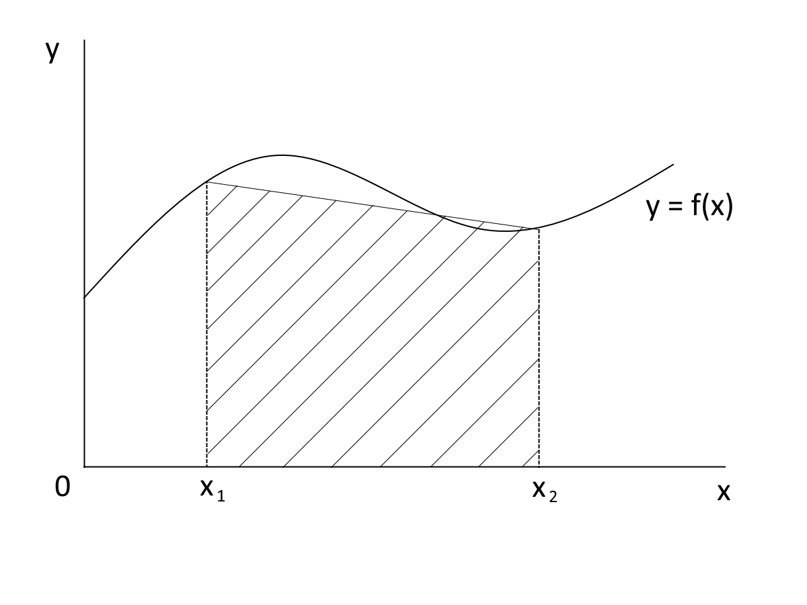
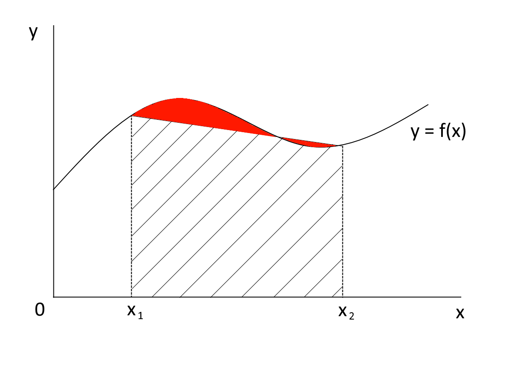
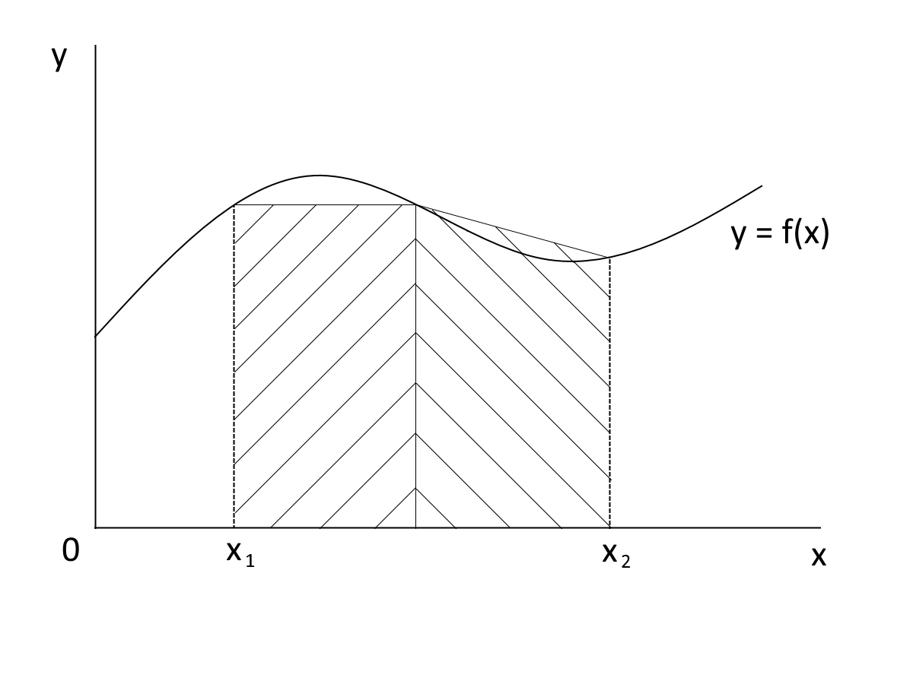
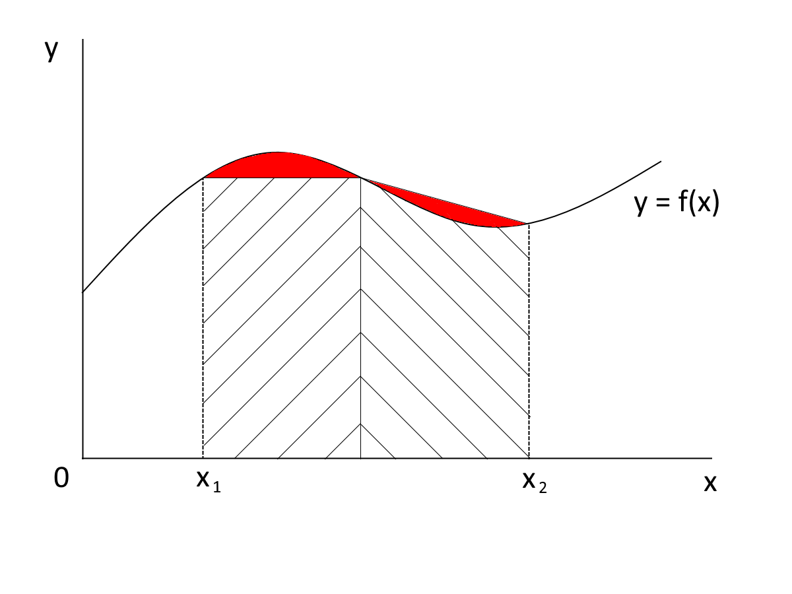
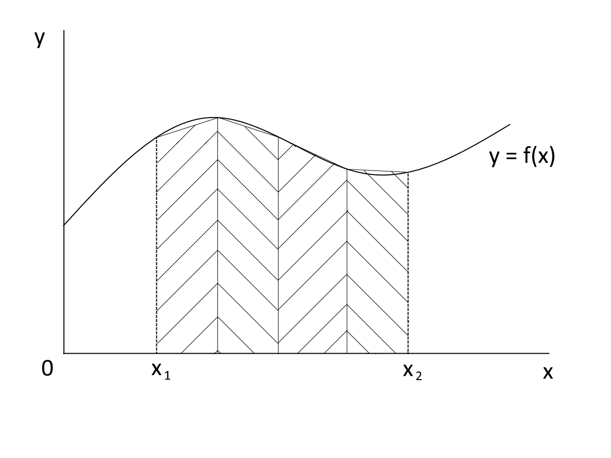

## Задача

Напишите программу на C#, вычисляющую приближённое значение интеграла функции `y = f(x)` на заданном интервале с заданной точностью.

## Указания

Задача решается численным методом, используя геометрический смысл интеграла функции на некотором интервале: это площадь фигуры, ограниченной абсциссой, кривой `y = f(x)`, а также двумя прямыми, параллельными оси ординат и проходящими через границы интервала.

Уравнение кривой считается неизвестным, а интеграл - нерешаемым аналитически. В своей программе реализуйте эту математическую функцию в виде метода, ссылка на который передаётся алгоритму в виде делегата. Примером подобной задачи в реальной жизни может быть снятие показаний датчиков при проведении физического эксперимента, где полученные показания ложатся на кривую, которую вы можете соединить линией на бумаге, но получить аналитический вид уравнения, описывающего физический процесс, - не удаётся.

В такой постановке найти точное значение интеграла невозможно. Однако возможно вычислить приближённое значение и оценить погрешность вычисления. Если погрешность недопустимо велика, то вычислить более точное значение и снова оценить погрешность. Повторять процесс до тех пор, пока заданная погрешность не будет достигнута. 

## Численный метод

Допустим, что `y = f(x)` - это прямая, соединяющая точки (x1, f(x1)) и (x2, f(x2)). Интеграл в таком случае равен площади трапеции с точками (x1, f(x1)), (x2, f(x2)), (x2, 0), (x1, 0). 

Принятое допущение вносит погрешность в вычисление - обозначена красным на изображении ниже.

Выполним разбиение интервала (x1, x2) на 2 равные части. Для каждого из полученных интервалов выполним вычисление, описанное в пункте 1, и сложим полученные значения. 

Очевидно, что полученное значение стало более точным, нежели то, что было рассчитано в пункте 1.

Выполним разбиение интервала (x1, x2) на 4 равных интервала. Выполним аналогичное вычисление. Получим ещё более точное значение интеграла.

В пределе, устремив число интервалов при разбиении к бесконечности, получим истинное значение интеграла. Это следует из определения интеграла. Ясно, что бесконечные вычисления нам не нужны. Однако и истинное значение тоже: нас устроит значение с некоторой точностью, которую можно задавать перед запуском алгоритма. При разбиении на большее число интервалов разность вычисленного значения интеграла со значением при меньшем количестве интервалов становится всё меньше. Именно так мы будем оценивать погрешность вычисления интеграла: разность между вычисленными значениями при разных разбиениях. Будем считать, что она убывает монотонно (то есть точность монотонно растёт). Значит, после того, как эта разность стала меньше заданной точности, мы можем прекратить вычисления и считать площадь при текущем разбиении ответом на поставленную задачу.

Важные аспекты численного метода:
- Вычисления нужно прекращать сразу по достижении заданной точности. Лишние вычисления не нужны
- Точность задаётся для полученного значения интеграла. Например, если задана точность `0,01`, а алгоритм выдал результат `2,37`, то истинное значение интеграла будет лежать в интервале `(2,36, 2,38)`
- Количество отрезков для разбиения рекомендуется увеличивать вдвое на каждом шаге - это позволит быстро "спуститься ближе" к истинному значению
